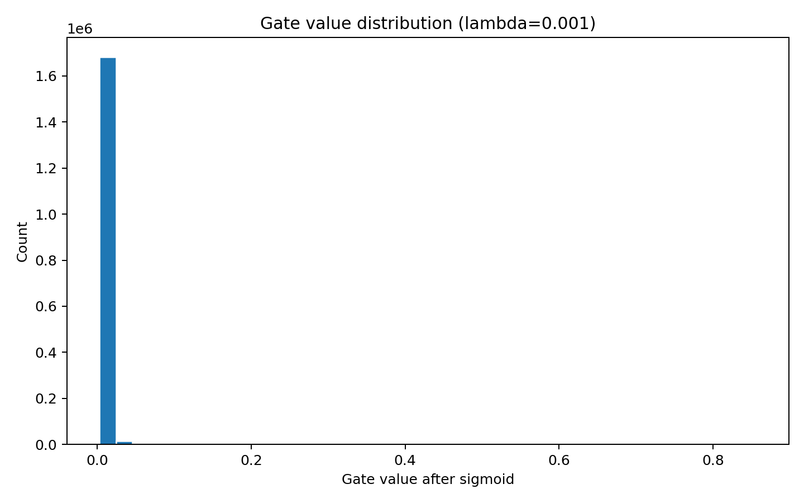
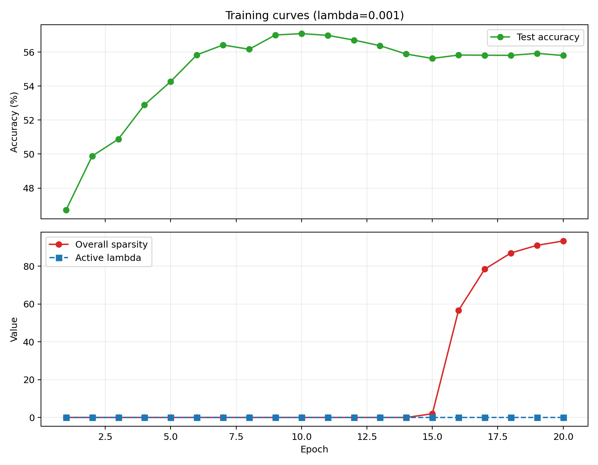
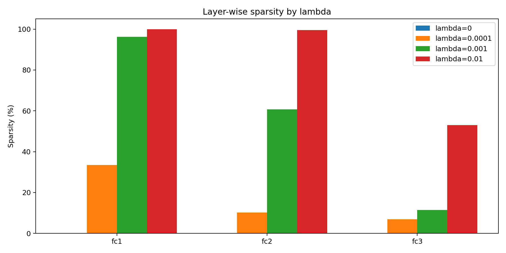
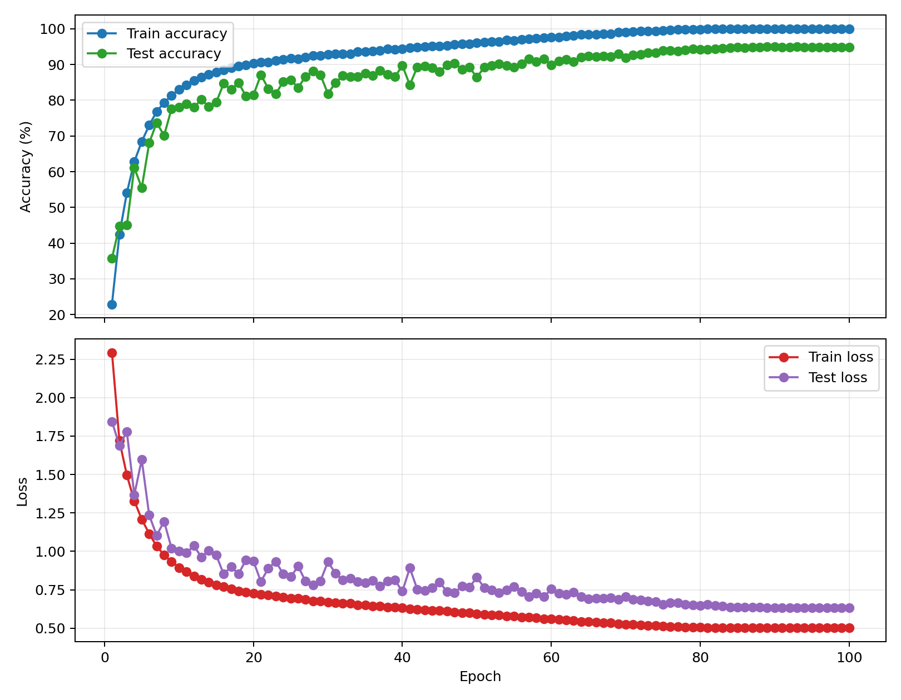

# Self-Pruning Network for CIFAR-10

## What I built

I implemented a three-layer MLP for CIFAR-10 where each weight is multiplied by a learnable gate:

`effective_weight = weight * sigmoid(gate_scores)`

If a gate moves close to zero, that connection is effectively removed. I replaced every fully connected layer with a custom `PrunableLinear` layer and trained the model with:

`total_loss = cross_entropy + lambda * sum(sigmoid(gate_scores))`

The goal was not just to get sparsity, but to see how much pruning I could get before accuracy started to fall apart.

## Why L1 produces sparsity

The important part is that L1 keeps applying pressure even when a gate is already small. That matters because once a connection becomes weak, the optimizer still has a reason to keep shrinking it toward zero. L2 behaves differently: its gradient gets smaller near zero, so it tends to leave a lot of tiny values instead of creating genuinely sparse structure. For this problem, L1 is the better fit because I want gates to die, not just become small.

Concretely, if I write the positive gate value as `g = sigmoid(score)`, the L1 term contributes `sign(g)`, which is `+1` for any positive value regardless of magnitude. L2's gradient is `2g`, so it shrinks toward zero as `g` does. L1 keeps pushing with the same constant force all the way down. That is why L1 produces genuine zeros while L2 mostly produces very small values.

## Experimental setup

- Dataset: CIFAR-10
- Input representation: flattened `32 x 32 x 3` image
- Architecture: `3072 -> 512 -> 256 -> 10`
- Optimizer: Adam
- Epochs: 20
- Batch size: 128
- Sparsity threshold: a gate is counted as pruned if `sigmoid(gate_score) < 1e-2`
- Lambda schedule: 5 warmup epochs, then 10 ramp-up epochs, then constant target lambda
- Sweep: `0.0`, `1e-4`, `1e-3`, `1e-2`

## Results

| Lambda | Peak test acc (%) | Final test acc (%) | Final sparsity (%) | Layer sparsity (`fc1/fc2/fc3`) | Notes |
| --- | --- | --- | --- | --- | --- |
| `0.0` | 55.47 | 53.59 | 0.00 | `0.00 / 0.00 / 0.00` | Useful baseline, but it overfit after the mid-point of training |
| `1e-4` | 57.25 | 55.67 | 31.70 | `33.53 / 10.21 / 6.91` | Best peak accuracy and a clean regularization effect |
| `1e-3` | 57.09 | 55.80 | 93.31 | `96.17 / 60.66 / 11.48` | Best trade-off: almost baseline-plus accuracy with very high sparsity |
| `1e-2` | 55.86 | 42.52 | 99.90 | `100.00 / 99.57 / 52.97` | Too aggressive, accuracy collapses once pruning fully kicks in |

## What I found

The first thing that stood out was that mild pruning actually helped. The baseline model with `lambda=0` peaked at `55.47%` test accuracy and then drifted down to `53.59%` by the end, which looks like straightforward overfitting. With `lambda=1e-4`, the model reached `57.25%` peak test accuracy and still finished at `55.67%`, so a small amount of sparsity pressure worked like useful regularization.

The more striking result came from `lambda=1e-3`: it ended at `55.80%` final test accuracy while pruning `93.31%` of the gates. That is only slightly below the best peak accuracy in the whole sweep, but with a dramatic reduction in active connections. If I had to defend one configuration as the best overall trade-off, I would pick `lambda=1e-3`.

The `lambda=1e-2` run shows the other end of the spectrum. It reached `99.90%` sparsity, but final accuracy dropped to `42.52%`. That run is still useful because it confirms the mechanism is working. The model really can delete almost everything, but the classification task becomes too under-parameterized once pruning becomes that aggressive.

## Layer-wise observation

The pruning pattern was not uniform across the network. `fc1` pruned much more aggressively than `fc3` in every nonzero-lambda run:

- `lambda=1e-4`: `fc1=33.53%`, `fc2=10.21%`, `fc3=6.91%`
- `lambda=1e-3`: `fc1=96.17%`, `fc2=60.66%`, `fc3=11.48%`
- `lambda=1e-2`: `fc1=100.00%`, `fc2=99.57%`, `fc3=52.97%`

I think this makes sense. The first layer has a huge number of input-to-hidden connections and therefore more redundancy. The final classifier layer is much smaller and closer to the actual class decision, so it stays denser for longer.

## Why the annealing schedule helped

I did not apply the full sparsity penalty from epoch 1. The model trained for five warmup epochs with zero pruning pressure, then lambda increased gradually over the next ten epochs.

That decision mattered. In the `lambda=1e-3` run, sparsity stayed near zero through the ramp, and then jumped sharply late in training:

- Epoch 10: `57.09%` test accuracy, `0.00%` sparsity
- Epoch 15: `55.63%` test accuracy, `1.95%` sparsity
- Epoch 16: `55.83%` test accuracy, `56.57%` sparsity
- Epoch 20: `55.80%` test accuracy, `93.31%` sparsity

This was exactly the behavior I wanted. The network first learned a workable representation, and only then started deleting connections aggressively. If I had used the target lambda from the start, the model would likely have pruned too early and lost accuracy much sooner.

The gate histogram for `lambda=1e-3` shows the expected bimodal pattern: a large spike near zero from pruned connections and a smaller cluster of surviving gates spread across higher values.

## Figures

### Gate distribution for the strongest trade-off run (`lambda=1e-3`)

### Accuracy and sparsity over time for `lambda=1e-3`

### Layer-wise sparsity across the full lambda sweep

## One honest limitation

This model is an MLP on flattened CIFAR-10 images, so the absolute accuracy ceiling is limited from the start. A convolutional model would almost certainly perform better on the task itself. I stayed with the MLP because the assignment is really about learning gates, sparsity, and the accuracy-pruning trade-off, but it is still a real limitation of the setup.

## Follow-up ResNet baseline

After finishing the sweep, I trained a `ResNet18` baseline on the same CIFAR-10 pipeline to answer one question: was 55% accuracy a problem with the training stack, or just the MLP architecture?

It reached:

- `95.04%` best test accuracy
- `94.91%` final test accuracy
- best epoch: `89`
- hardware: `NVIDIA GeForce RTX 3050 Ti Laptop GPU`
- batch size: `256`
- epochs completed: `100`

That made the MLP limitation concrete. The pruning mechanism was working fine. The ceiling was the architecture choice, not a bug.

### ResNet training curves

## Final takeaway

Self-pruning worked best as controlled regularization rather than a hard constraint. The jump from epoch 15 to epoch 16 in the `lambda=1e-3` run, where sparsity went from `1.95%` to `56.57%` in one epoch, was the clearest evidence that the annealing schedule was doing real work.

If I were extending this, I would look at structured pruning next, removing entire neurons rather than individual weights. That would actually reduce inference compute, which soft sigmoid gates do not do by themselves.
